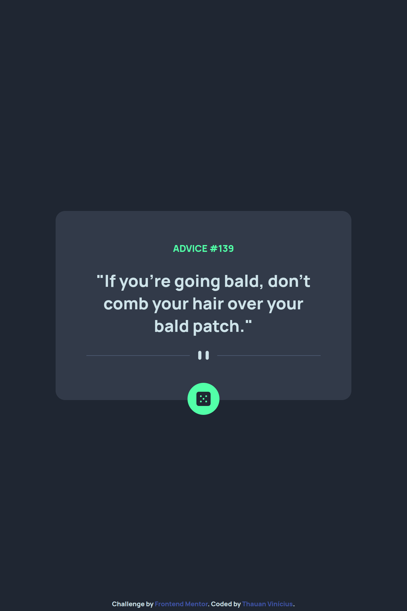
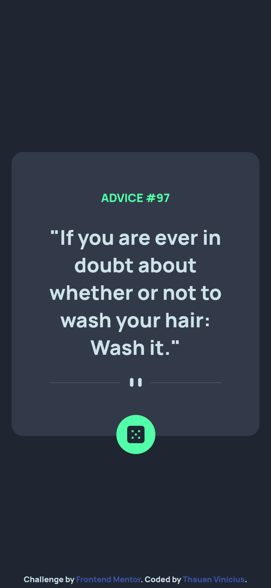

# Frontend Mentor - Advice generator app solution

This is a solution to the [Advice generator app challenge on Frontend Mentor](https://www.frontendmentor.io/challenges/advice-generator-app-QdUG-13db). Frontend Mentor challenges help you improve your coding skills by building realistic projects.

## Table of contents

- [Overview](#overview)
  - [The challenge](#the-challenge)
  - [Screenshot](#screenshot)
  - [Links](#links)
- [My process](#my-process)
  - [Built with](#built-with)

## Overview

### The challenge

Users should be able to:

- [x] View the optimal layout for the app depending on their device's screen size
- [x] See hover states for all interactive elements on the page
- [x] Generate a new piece of advice by clicking the dice icon

### Screenshot

  
Desktop

  

  
Tablet

  

  
Mobile

  

### Links

- Solution URL: [Solution URL](https://github.com/vinii-dev/frontend-mentor-challenges/tree/main/advice-generator-app-main)

### Built with

- HTML 5
- CSS 3
- JavaScript
- Flexbox
- CSS Grid
- [Advice Slip JSON API](https://api.adviceslip.com/)
